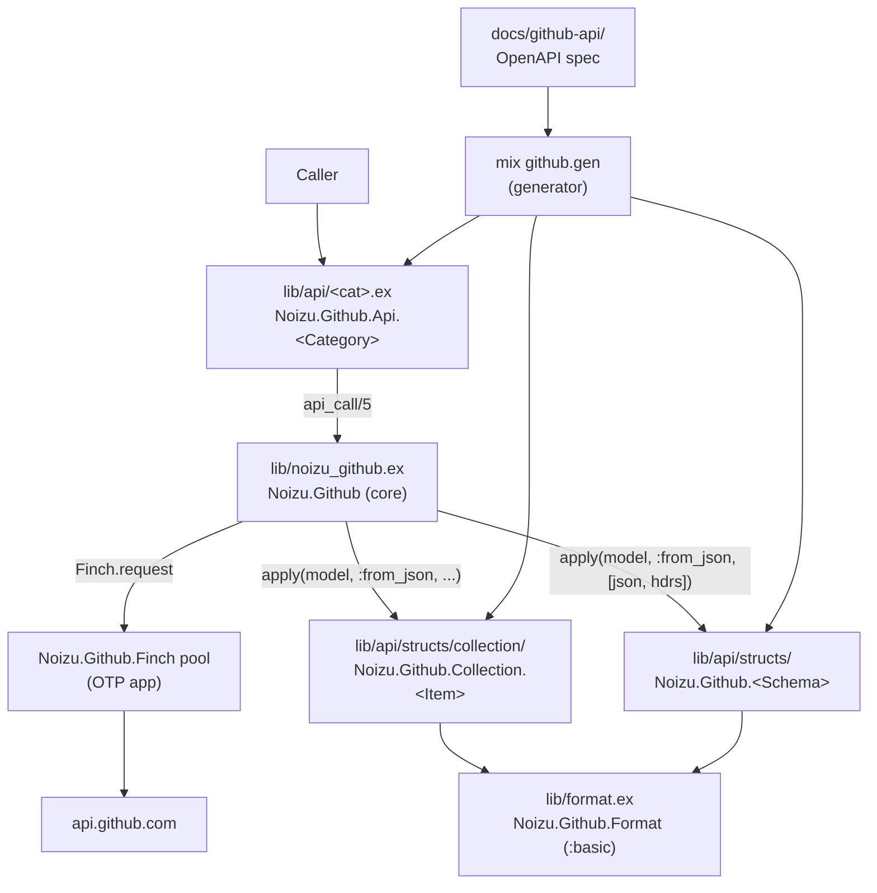

# Project Architecture

`elixir-github` (`:noizu_github`) is a spec-driven Elixir client for the GitHub
REST API. Rather than hand-maintaining hundreds of endpoints, a generator
(`mix github.gen`) reads a vendored OpenAPI description and emits the entire
client surface — category modules, permissive schema structs, and typed
collection wrappers. A small hand-written core provides the HTTP transport and
decode contracts the generated code dispatches through.

The split is deliberate: **the generator owns fidelity** (complete, spec-faithful
decode for every endpoint), while **hand-written code owns transport and
curation** (one HTTP entry point, curated display views). Generated files are
disposable; hand-written files survive regeneration.

## System Diagram

## Core Components

| Component | Purpose |
|-----------|---------|
| `Noizu.Github` (`noizu_github.ex`) | Core client. Single HTTP entry point `api_call/5`, auth/version headers, `Link`-header pagination parsing, query/body helpers. |
| `Noizu.Github.Application` (`application.ex`) | OTP app; supervises the `{Finch, name: Noizu.Github.Finch}` HTTP pool. |
| `Mix.Tasks.Github.Gen` (`github.gen.ex`) | Generator. Reads the OpenAPI spec, emits every module/struct under `lib/api/`. |
| `Noizu.Github.Api.<Category>` (49 modules) | Generated. One function per operation; builds URL + body, delegates to `api_call/5`. |
| `Noizu.Github.<Schema>` (826 structs) | Generated. Permissive `from_json/2` decoders, one per object schema. |
| `Noizu.Github.Collection.<Item>` (110 wrappers) | Generated. Typed list results carrying pagination links. |
| `Noizu.Github.Raw` / `Noizu.Github.Collection` | Generated runtime fallbacks for unmapped/inline/empty bodies and untyped arrays. |
| `Noizu.Github.Format` (`format.ex`) | Hand-maintained. Curated `:basic` display projections over generated structs. |

## Request & Decode Flow

Every endpoint funnels through one function. `api_call/5` encodes the body,
sends the request via the Finch pool, checks the status, decodes the body, then
dynamically applies the operation's chosen model's `from_json/2`. The model is a
plain module atom baked into each generated call, so dispatch is a single
`apply/3` with no per-endpoint wiring. Pagination is carried out-of-band:
`extract_links/1` parses the `Link` header and attaches `%{next:, last:, ...}` to
the result.

→ *See [arch/request-flow.md](arch/request-flow.md) for the step-by-step decode
path, status handling, streaming, and pagination contract.*

## Generation & Decode Hierarchy

The generator resolves a response model per operation (`classify_schema`): a
`$ref` to a structable schema becomes `Noizu.Github.<Schema>`; an array of such
becomes a typed `Noizu.Github.Collection.<Item>`; everything else (inline
objects, unions, empty `204`s, untyped arrays) falls back to `Raw`/`Collection`.
Structs decode recursively via `from_json/2`, referencing nullable/nested
schemas. The fallback modules guarantee every endpoint returns something typed,
even when the spec is ambiguous.

→ *See [arch/generation.md](arch/generation.md) for the spec-to-code mapping,
struct decode conventions, and the fallback/resolution rules.*

## Key Decisions

- **Spec-driven over hand-written**: 787 paths × schemas are generated from the
  vendored OpenAPI description; only the transport core and curated views are
  hand-maintained. Re-running the generator is how the client tracks the API.
- **One dispatch point**: every generated call routes through `Noizu.Github.api_call/5`,
  so transport logic (auth, timeouts, decoding, logging hooks) lives in exactly
  one place.
- **Permissive structs with a curated layer on top**: generated structs are
  spec-faithful and lenient (extra/missing keys tolerated); `Noizu.Github.Format`
  adds the small `:basic` projections consumers actually want, without entangling
  display concerns with generated code.
- **Typed-but-fallback collections**: list results get a typed wrapper when the
  item schema is known, else a generic `Collection`; both carry pagination links.
- **Generated code is disposable**: all generated files carry a "do not edit"
  banner and live under `lib/api/`; hand-written code lives at `lib/` root +
  `lib/format.ex`, so regeneration never wipes curated logic.

## Technology Stack

| Layer | Choice |
|-------|--------|
| Language | Elixir 1.20 / OTP 29 |
| HTTP | [Finch](https://github.com/sneako/finch) (`~> 0.19`), supervised pool `Noizu.Github.Finch` |
| JSON | [Jason](https://github.com/michalmuskala/jason) (`~> 1.2`) |
| API source | GitHub REST OpenAPI description (vendored, `docs/github-api/`) |
| Test stubbing | [Mimic](https://github.com/hamiltop/mimic) (`~> 1.0`, test-only) |
| Docs | `ex_doc` (dev-only) |

## References

- [PROJ-LAYOUT.md](PROJ-LAYOUT.md) — navigable directory map.
- `docs/github-api/README.md` — provenance of the vendored OpenAPI spec.
- `README.md` — usage and configuration.
