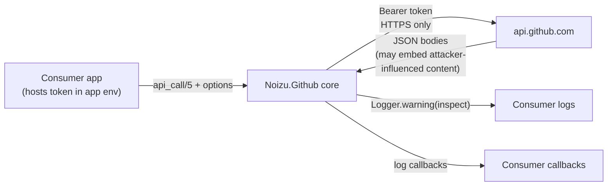

# Threat Model

`elixir-github` is a **library**, not a deployed service: it runs inside a
consumer's BEAM process and makes credentialed outbound calls to
`https://api.github.com`. There is no ingress, no datastore, and no UI. The
attack surface is therefore small and centered on one crown jewel: the **GitHub
token** (`api_key` app-env or per-call `token:` option) — and on data flowing
back from GitHub into the consumer's process.

Trust boundaries: consumer app ↔ library (in-process, none) · library ↔ GitHub
REST API (HTTPS, Bearer-authenticated) · GitHub-hosted content ↔ consumer
memory/logs (decode + logging paths).

Grounding: components and flow per [PROJ-ARCH.md](PROJ-ARCH.md) /
[arch/request-flow.md](arch/request-flow.md); code map per
[PROJ-LAYOUT.md](PROJ-LAYOUT.md).

## Attack Surface

## Vulnerability Register

| ID | Severity | STRIDE | Component | Status |
|----|----------|--------|-----------|--------|
| T-001 | High | Information disclosure | `api_call/5` error paths (`noizu_github.ex`) | Open |
| T-002 | Medium | DoS | `decode_response` (`keys: :atoms`) | Open |
| T-003 | Low | Tampering | `mix github.gen` + vendored spec | Mitigated (provenance) |
| T-004 | Low | Spoofing | Token egress destination | Mitigated (by design) |
| T-005 | Low | Information disclosure | `request_log_callback` / `response_log_callback` | Accepted (consumer-owned) |

## Findings

### T-001 — Bearer token can reach logs on any non-2xx

Both error branches log the raw error with `Logger.warning("API ERROR: \n
#{inspect error}")` (and the stream variant). On a non-2xx status the `with`
chain yields `{:error, %Finch.Response{}}`; `Finch.Response` carries the
original `%Finch.Request{}` **including the `Authorization: Bearer …` header**,
so a single failed call (401, 404, secondary-rate-limit 403) can write the token
into consumer logs. Mitigation: redact request headers (or log only
`status`/`body`) in the error paths.

### T-002 — Atom-table growth via `Jason.decode(keys: :atoms)`

All response bodies decode with `keys: :atoms` (`String.to_atom` semantics).
Most keys are spec-fixed, but endpoints returning arbitrary repo/user content
(blob bodies, variable-shape payloads) let a hostile GitHub-side or
content-influencing actor mint unbounded atoms → BEAM atom exhaustion. Mitigation:
`keys: :atoms!` + tolerant access, or a key-whitelist pass.

### T-003 — Spec poisoning feeds generated code

The vendored OpenAPI description (`docs/github-api/`) is the source the
generator turns into executable modules; a tampered spec becomes tampered code.
Mitigated by provenance: files come from `github/rest-api-description`, pinned
snapshot `2026-03-10` documented in `docs/github-api/README.md`. Re-vendor only
from upstream; diff on update.

### T-004 — Token egress destination is fixed

`@github_base "https://api.github.com"` is hardcoded (no per-call base-URL
override), so the token cannot be steered to an attacker host through library
options; Finch performs default TLS verification. Residual: DNS/pKI compromise
is out of scope for the library.

### T-005 — Log callbacks receive full request/response structs

`request_log_callback` / `response_log_callback` are consumer-supplied and
receive Finch structures including auth headers. The library never invokes them
itself; whatever the consumer logs there is the consumer's control. Accepted,
documented here.

## Secret handling

The token exists only in app-env (`NoizuLabs.Github.Config`), per-call options,
and outgoing headers. The library does not persist secrets. `config/test.secret.exs`
is gitignored; no secret material is committed (verify when vendoring).

## Residual Risk

T-001 and T-002 are open, known code-level issues with small patches; until
fixed, consumers should treat their logs as token-bearing and avoid calling
content-arbitrary endpoints in long-lived nodes. No other residual risk accepted.

## Mitigation Coverage

2 mitigated · 1 accepted · 2 open (T-001, T-002 — code fixes, no tickets yet).
